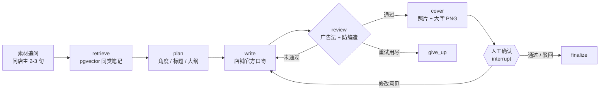

# 店铺笔记助手（xhs-agent）

给餐饮店写小红书图文的 Agent。店主说一句今天想发什么、回答两三个问题，就能拿到能直接发的标题、正文、标签和照片封面——**价格和优惠只会来自店主给的信息，不会乱编**。

**[▶ 在线演示](https://czczccc.github.io/xhs-agent/demo/)**（手机打开效果最佳，回放真实生成结果）· **[项目说明](https://czczccc.github.io/xhs-agent/)** · **[评测报告](evals/REPORT.md)**

- **LangGraph 编排**：追问 → 检索 → 规划 → 写作 → 审核（不通过带着问题重写）→ 封面 → 人工确认（interrupt，可断点续跑）
- **防编造审核**：正文里的价格、折扣、时间、优惠说法必须能在店铺档案 / 需求 / 店主回答里找到；24 个评测用例零编造
- **可量化的迭代**：24 个餐饮用例 + LLM 严格裁判，提示词迭代让「像店主」从 3.04 → 4.25；并如实测出**检索和追问没有带来提升**
- **能给真人用的完整链路**：手机端前端、照片封面、SSE 真实进度、试用码（访问 / 档案 / 每日额度 / 店间隔离）、反馈与行为埋点
- 61 个测试（含 Postgres 集成测试），无 API Key 时用 `FakeLLM` 离线跑通

## 架构



| 模块 | 做什么 | 代码 |
|---|---|---|
| 工作流 | LangGraph 状态图；`interrupt_before` 等人工确认；`PostgresSaver` 让服务重启后能接着确认；流式产出节点事件 | `graph.py` |
| 节点 | 每步用 Pydantic 校验输出，格式错把错误喂回模型重试，仍失败以 `status=error` 结束不崩 | `nodes/steps.py` |
| 审核 | 敏感词 + 餐饮广告法词表（商家模式）+ `unsupported_claims` 防编造；「第一步」这类放行短语 | `review.py` |
| 检索 | pgvector 余弦检索，参考笔记标注来源（商家 / 博主）和收藏数；也有零依赖的内存检索 | `retrieval.py` `embedding.py` |
| 封面 | 1080×1440 PNG，三种样式，中文行长平衡断行 | `cover.py` |
| 上传 | 校验、按 EXIF 摆正、缩到 2000px、重新编码去掉定位信息 | `uploads.py` |
| 试用码 | 6 位码管访问、服务端档案、原子扣减的每日额度、反馈归属 | `shops.py` |
| 反馈 | 评分（以最后一次为准）+ 复制 / 保存 / 换样式行为信号，按店和内容类型汇总 | `feedback.py` |
| 发布 | 店主手动确认后一键发到小红书，调用外部 xiaohongshu-mcp（浏览器自动化，非官方 API） | `publish.py` |
| Web | FastAPI + SSE；手机端单页前端（原生 JS，无构建） | `web/` |

## 评测结论（详见 [REPORT.md](evals/REPORT.md)）

| 版本 | 改动 | 吸引力 | 相关性 | 想去店里 | 像店主 |
|---|---|---|---|---|---|
| v1 | 商家模式基线 | 3.00 | 4.33 | 3.04 | 3.04 |
| v2 | 提示词去模板感 | 3.67 | 4.71 | 3.88 | 3.96 |
| v2 | + 109 条餐饮参考笔记 | 3.58 | 4.67 | 4.00 | 4.00 |
| **v3** | 结尾带出店名位置、活动规则写全 | **3.75** | **4.79** | **4.17** | **4.25** |
| v3 | + 素材追问（模拟店主） | 3.70 | 4.35 | 3.90 | 4.15 |

- 起作用的是提示词；**换参考库、加追问都在噪声内**，追问需要真实店主验证
- 裁判一开始给所有笔记打 4-5 分、量不出好坏，改成带分档标准的严格裁判后才拉开差距
- 局限：裁判与生成同为 DeepSeek，样本小、每组一次；±0.2 以内视为噪声

## 封面与配图

**默认用模板渲染封面，不用生图模型。**

- 小红书封面以大字为主，模板渲染中文零错字、风格统一；生图模型写中文仍容易出错
- 零成本、毫秒级出图，评测可以随便重跑
- **不生成菜品图**：AI 画的菜和编造价格一样属于虚假宣传；用店主上传的真实照片作底图，再叠加大字
- 生图模型（暂不做）：只生成背景 / 氛围图、文字仍由模板叠加；人工确认文案后再生图，避免为被驳回的版本付费；做成可替换后端，评测时关闭

## 快速开始

```bash
python -m venv .venv && source .venv/bin/activate   # Windows: .venv\Scripts\activate
pip install -e ".[dev]"
cp .env.example .env          # 填 LLM_API_KEY；不填则用 FakeLLM

pytest                                         # 固定用 FakeLLM，不消耗 API；Postgres 测试默认跳过
REQUIRE_SHOP_CODE=false uvicorn xhs_agent.web.app:app   # 本地 Web：http://localhost:8000（/debug 是调试页）
xhs-agent "周三酸菜鱼半价" --shop data/shops/example.json --type 活动 --extra "每周三全天"
python evals/run_eval.py --topics evals/merchant_topics.jsonl --judge --interview
```

模型走任意 OpenAI 兼容接口（DeepSeek、通义、Moonshot…）；只支持流式的中转服务设 `LLM_STREAM=true`。

### Postgres + pgvector（检索、状态、试用码、反馈）

```bash
pip install -e ".[pg]"
docker compose up -d                  # 或任意带 pgvector 的 Postgres，填 DATABASE_URL
xhs-db init                           # 建表（自动探测 embedding 维度）+ LangGraph checkpoint 表
xhs-db import notes.json --dry-run    # 校验参考笔记文件；去掉 --dry-run 才写入
xhs-db search "火锅 上新"              # 看检索效果
xhs-db shop add --label "巷口小馆·王姐" # 生成试用码（shop list / limit / disable / enable）
xhs-db feedback                       # 汇总店主反馈：能直接发比例、复制率、店主原话
```

`.env` 里设 `RETRIEVER=pgvector`、`STORAGE=postgres` 启用。集成测试：`TEST_DATABASE_URL=postgresql://.../xhs_test pytest tests/test_pg.py`。

**参考笔记数据不在仓库里**：评测用的 109 条餐饮笔记是公开笔记的标题 / 正文 / 标签 / 点赞收藏数，属于他人发布的内容，未公开。
格式为 JSON 数组或 jsonl：`{"title", "body", "tags", "likes", "collects", "shop_type", "content_type", "author_type", "city"}`，
`likes` 可写 `"1.2万"`，正文里的 `#话题[话题]#` 会自动拆进 `tags`。`data/sample_notes.jsonl` 是自编的示例。

### 发布到小红书（可选，一键发帖）

结果页可以直接把审核通过的图文发到小红书，不用再手动复制粘贴。**依赖店主自己的小红书账号登录态**，
通过外部项目 [xiaohongshu-mcp](https://github.com/xpzouying/xiaohongshu-mcp) 做浏览器自动化发布——**不是小红书官方 API**，
账号会有被平台限流 / 封禁的风险，且发布后不可撤回，所以这一步永远要店主在结果页手动点「发布到小红书」+「确认发布」才会触发，
生成流程本身不会自动发帖。

```bash
pip install -e ".[publish]"
docker compose --profile publish up -d xiaohongshu-mcp   # 起浏览器自动化服务
# 首次需要单独扫码登录一次（同一账号同时只能在一处网页端登录），参见 xiaohongshu-mcp 项目文档
```

`.env` 里设 `XHS_MCP_URL=http://localhost:18060/mcp` 启用；留空就不启用，结果页也不会出现发布按钮。
分开部署（例如各自在 Docker 网络里）时还要设 `PUBLIC_BASE_URL`，让 xiaohongshu-mcp 能反过来拉取本服务生成的封面和照片。

### 演示站

`docs/` 是 GitHub Pages 站点。`python scripts/build_demo.py` 把真实前端复制到 `docs/demo/`，
并注入一层回放（`demo-pre.js` 拦截 `/api/*`、`demo-post.js` 换成示例店铺），回放的都是评测里真实生成的结果。

## 目录

```
src/xhs_agent/
  graph.py         LangGraph 工作流 + XhsAgent（start / resume / ask / 流式版本）
  nodes/steps.py   各节点、追问、封面渲染调度
  schemas.py       Pydantic：请求、店铺档案、规划、草稿、审核结果
  prompts.py       通用 / 商家 / 追问提示词
  review.py        规则审核 + 防编造
  llm.py           OpenAI 兼容客户端（含流式、控制标记清理）+ FakeLLM
  retrieval.py     内存检索 / pgvector 检索
  embedding.py     OpenAI 兼容 embedding + FakeEmbedder
  db.py            连接池、建表、导入、runs 记录、xhs-db 命令
  shops.py         试用码与每日额度
  feedback.py      反馈与行为事件
  cover.py         封面渲染    uploads.py  照片上传
  publish.py       一键发布到小红书（调用外部 xiaohongshu-mcp，需店主手动确认）
  web/             FastAPI + 手机端前端（templates/index.html）+ 调试页
evals/             选题集、商家用例（含模拟店主 owner_notes）、run_eval.py、REPORT.md
docs/              GitHub Pages：项目说明、演示、设计稿、试用实施方案
scripts/           build_demo.py
tests/             61 个测试
```

## 状态与已知问题

项目停在「可以找真实店主试用」的阶段。真实试用中发现：

- **追问的问题预设会被当成事实**（问「有没有几乎每周都来的老客」，文案就写「几乎每周都来」）——数字规则查不出这种语义越界，需要 LLM 审核层
- 封面是「照片 + 大字」模板，和小红书真实餐饮封面（多图拼接、贴纸、手写字）差距明显
- 写文案本身不是壁垒：店主用通用聊天机器人也能得到相近的文案；在小红书上图片比文字更重要
